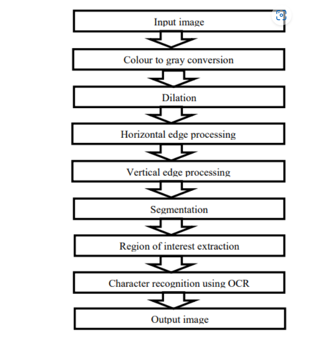

# Car Document Validation through Automated Number Plate Monitoring using YOLO

## Overview
This project automates vehicle document verification using Automatic Number Plate Recognition (ANPR) and YOLO (You Only Look Once) for number plate detection. The system captures vehicle number plates, extracts text using OCR, and cross-references it with a database to validate essential documents like:
- Pollution Under Control (PUC) certificate
- Car registration details
- Remaining years of road eligibility

## Features
- **Real-time Number Plate Recognition**: Captures vehicle plates using a camera and processes them using YOLO.
- **OCR-based Text Extraction**: Converts detected number plate images into text.
- **Database Cross-Verification**: Checks extracted text against a CSV/Excel database.
- **Automated Document Validation**: Ensures compliance with regulatory requirements.
- **Alert System**: Generates alerts for missing or expired documents.
- **Improved Efficiency**: Reduces manual verification errors and enhances enforcement efforts.

## Problem Statement
Manually verifying vehicle documents is inefficient, time-consuming, and error-prone. This project automates the process using computer vision and database integration, ensuring accurate, real-time compliance monitoring.

## Technologies Used
- **Programming Language**: Python
- **Deep Learning Model**: YOLO (for number plate detection)
- **OCR**: Tesseract OCR (for character recognition)
- **Database**: CSV/Excel (for vehicle document storage)
- **Image Processing**: OpenCV

## Project Workflow
1. **Capture Image**: A camera captures the vehicle's number plate.
2. **Pre-processing**: Convert the image to grayscale and apply filtering.
3. **Number Plate Detection**: YOLO extracts the number plate region.
4. **Text Extraction**: OCR reads characters from the extracted plate.
5. **Database Lookup**: The extracted text is checked in the CSV/Excel database.
6. **Document Validation**: The system verifies PUC, registration, and eligibility.
7. **Result Display**: The system shows compliance status and generates alerts if needed.

## Working Process
Below is the working process of the ANPR system:



## Installation & Setup
### Prerequisites
Ensure you have Python installed along with the following dependencies:
```bash
pip install opencv-python numpy pandas pytesseract torch torchvision
```
### Running the Project
1. Clone the repository:
   ```bash
   git clone https://github.com/your-repo/anpr-validation.git
   cd anpr-validation
   ```
2. Run the detection script:
   ```bash
   python main.py
   ```
3. Ensure the CSV/Excel database file is present in the project directory.

## Applications
- Traffic law enforcement
- Automated toll collection
- Smart parking systems
- Vehicle compliance verification

## Future Enhancements
- Integration with cloud-based vehicle databases.
- Support for additional document types.
- Improved OCR accuracy using deep learning.

## Contributors
- **Revanth D Rampal** (revanthdrampal@gmail.com)
